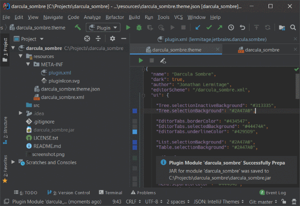

<h1 align="center">
    Darcula Sombre
</h1>

    IntelliJ IDEA (and other JetBrains products) theme. Like Darcula, but darker.

## Author

Jonathan Lermitage (<jonathan.lermitage@gmail.com>)  
Linkedin profile: [jonathan-lermitage-092711142](https://www.linkedin.com/in/jonathan-lermitage-092711142/)

## License

MIT License. In other words, you can do what you want: this project is entirely OpenSource, Free and Gratis.
